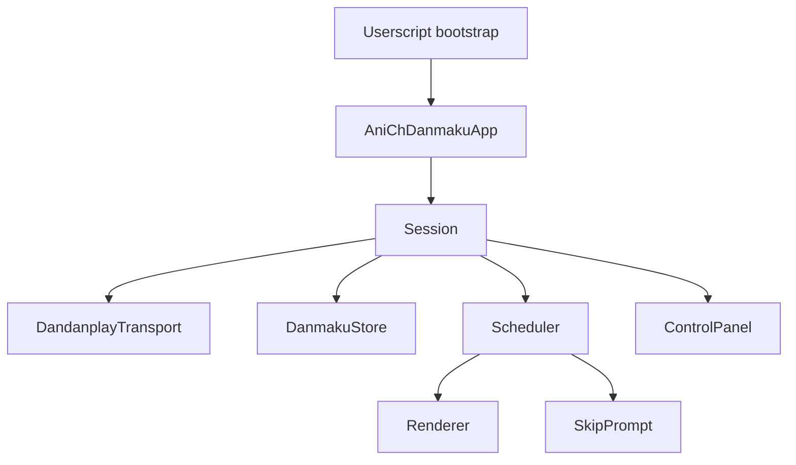

# Project Overview

## Preliminary Direction
Maintain an AniCh-specific userscript that provides Dandanplay-based danmaku matching, loading, normalization, scheduling, rendering, and basic controls while leaving native video playback untouched.

## Current Architecture

The repository currently contains a single-file userscript that owns the AniCh-side Dandanplay workflow end to end. It resolves page context, searches Dandanplay entries, loads episode comments, normalizes them into a single schema, filters and schedules them against the active video, renders them in an overlay, exposes an external toolbar plus settings panel, and now derives a separate skip-cue prompt path from normalized comments.

The runtime is organized as a single-file userscript injected at `document-start` and split into these logical boundaries:

- `Session`
- `PageContextResolver`
- `DandanplayTransport`
- `DanmakuStore`
- `Scheduler`
- `Renderer`
- `SkipPrompt`
- `ControlPanel`

## Technology Stack
| Layer | Current | Target |
|:------|:--------|:-------|
| Language | JavaScript ES2020 userscript | JavaScript ES2020 userscript |
| Framework | None | None |
| Build Tool | None | None |
| Package Mgr | None | None |
| Database | Browser `localStorage` only | Browser `localStorage` only |
| Deployment | Manual userscript install | Manual userscript install |

## Entry Points
- `anich-danmaku-fix.user.js`: current userscript bootstrap and runtime.
- `https://anich.emmmm.eu.org/b/*`: only supported runtime route.
- Dandanplay API endpoints:
  - `/search/episodes`
  - `/bangumi/:id`
  - `/comment/:episodeId`

## Build & Run
- No build step.
- Install the userscript in Tampermonkey/Violentmonkey.
- Open any `https://anich.emmmm.eu.org/b/<bangumi>/<episode>` route.

## External Integrations
- AniCh SPA player bundle at `https://anich.emmmm.eu.org/assets/index-69e4b648.js` as the runtime contract reference.
- Dandanplay API and compatible proxy/custom endpoints.
- Browser APIs:
  - `fetch`
  - `MutationObserver`
  - `ResizeObserver`
  - `requestAnimationFrame`
  - `localStorage`
  - Fullscreen / video events
