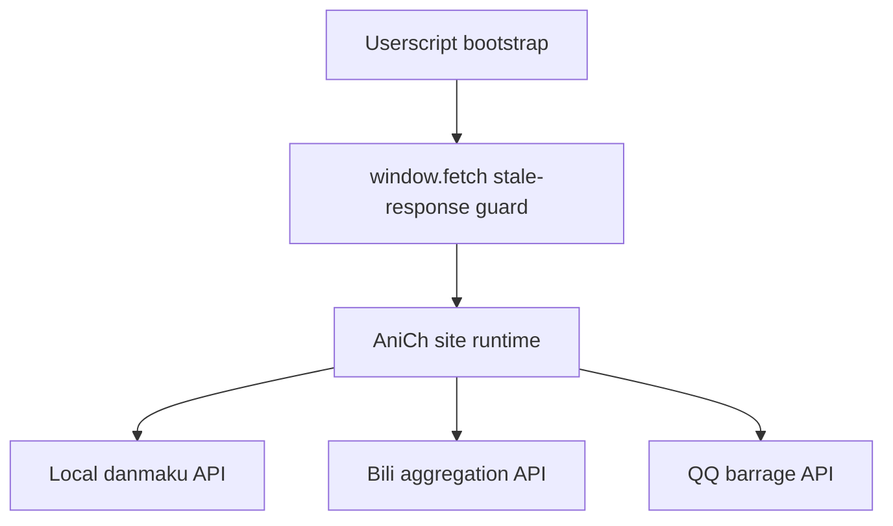

# Project Overview

## Preliminary Direction
Rebuild the current AniCh danmaku workaround into an `anich`-specific userscript that fully takes over danmaku fetch, normalization, scheduling, rendering, and basic controls while leaving native video playback untouched.

## Current Architecture

The repository currently contains a single userscript that patches `window.fetch` to drop stale danmaku responses after route changes. It does not own the danmaku lifecycle. Rendering, store state, request retry logic, and UI all remain inside AniCh's native player bundle, so direct-open or slow-network race conditions can still leak stale episode state into the current session.

The target architecture replaces that with a single-file userscript that injects a page-context runtime at `document-start` and splits responsibilities into:

- `SessionManager`
- `FetchInterceptor`
- `ParserAdapters`
- `DanmakuStore`
- `Scheduler`
- `Renderer`

## Technology Stack
| Layer | Current | Target |
|:------|:--------|:-------|
| Language | JavaScript ES2020 userscript | JavaScript ES2020 userscript |
| Framework | None | None |
| Build Tool | None | None |
| Package Mgr | None | None |
| Database | Browser `localStorage` only | Browser `localStorage` only |
| Deployment | Manual userscript install | Manual userscript install |

## Entry Points
- `anich-danmaku-fix.user.js`: current userscript bootstrap.
- `https://anich.emmmm.eu.org/b/*`: only supported runtime route.
- Shadow danmaku sources:
  - `https://anich.sends.eu.org/danmaku`
  - `https://bili-dm.emmmm.eu.org/`
  - `https://dm.video.qq.com/barrage/segment/...`

## Build & Run
- No build step.
- Install the userscript in Tampermonkey/Violentmonkey.
- Open any `https://anich.emmmm.eu.org/b/<bangumi>/<episode>` route.

## External Integrations
- AniCh SPA player bundle at `https://anich.emmmm.eu.org/assets/index-69e4b648.js` as the runtime contract reference.
- AniCh local danmaku protobuf API.
- Bili aggregated protobuf API.
- QQ barrage JSON API.
- Browser APIs:
  - `fetch`
  - `MutationObserver`
  - `ResizeObserver`
  - `requestAnimationFrame`
  - `localStorage`
  - Fullscreen / video events
