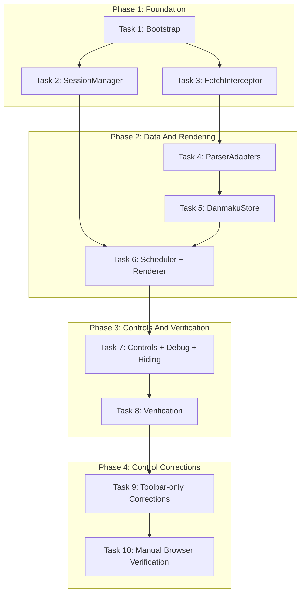

# Task Dependency Graph

```mermaid
graph TD
    subgraph Phase1 [Phase 1: Foundation]
        T1[Task 1: Bootstrap]
        T2[Task 2: SessionManager]
        T3[Task 3: FetchInterceptor]
        T1 --> T2
        T1 --> T3
    end

    subgraph Phase2 [Phase 2: Data And Rendering]
        T4[Task 4: ParserAdapters]
        T5[Task 5: DanmakuStore]
        T6[Task 6: Scheduler + Renderer]
        T3 --> T4
        T4 --> T5
        T2 --> T6
        T5 --> T6
    end

    subgraph Phase3 [Phase 3: Controls And Verification]
        T7[Task 7: Controls + Debug + Hiding]
        T8[Task 8: Verification]
        T6 --> T7
        T7 --> T8
    end

    subgraph Phase4 [Phase 4: Control Corrections]
        T9[Task 9: Toolbar-only Corrections]
        T10[Task 10: Manual Browser Verification]
        T8 --> T9
        T9 --> T10
    end
```
